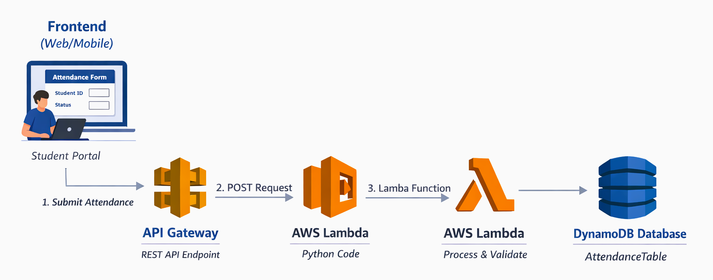

# Smart Attendance System Architecture

## Overview

The **Smart Attendance System** is designed to automate and simplify attendance tracking for students using a cloud-based architecture. It leverages **AWS services**, serverless computing, and a **RESTful API** backend to record, store, and retrieve attendance data securely and efficiently.

## System Components

### Frontend

- **Purpose:** Interface for students and administrators to interact with the system.

- **Technologies:**

    - HTML/CSS/JavaScript (or any web/mobile framework)

    - Forms for attendance submission (student_id, status)

- **Workflow:**

    - Student opens the attendance portal.

    - Submits student ID and attendance status.

    - Data is sent via HTTP POST to the backend API.

### Backend API (AWS Lambda)

- **Purpose:** Handles attendance requests and communicates with the database.

- **Technologies:**

    - Python 3.x

    - AWS Lambda (Serverless Function)

- **Key Features:**

    - Validates input data (student_id, status).

    - Generates a unique attendance_id using UUID.

    - Adds a timestamp (UTC) for each entry.

    - Stores attendance data into DynamoDB.

### Database (AWS DynamoDB)

- **Purpose:** Stores all attendance records securely.

- **Table:** AttendanceTable

- **Schema:**

    - attendance_id (Primary Key, string)

    - student_id (string)

    - status (string, e.g., Present/Absent)

    - timestamp (string, ISO format)

- **Characteristics:**

    - NoSQL database, highly scalable.

    - Serverless, automatically managed by AWS.

    - Supports fast read/write operations.

### API Gateway

- **Purpose:** Exposes a secure HTTP endpoint for the frontend to interact with Lambda.

- **Features:**

    - Handles POST requests from the frontend.

    - Routes requests to the correct Lambda function.

    - Enables CORS for cross-origin requests.

    - Supports request/response validation.

### System Workflow

- **Student Interaction:** Student submits attendance via the frontend form.

- **API Gateway:** Receives the HTTP request and forwards it to Lambda.

- **Lambda Processing:**

    - Validates the input.

    - Generates a unique attendance_id.

    - Adds a UTC timestamp.

    - Inserts the record into DynamoDB.

- **Database Storage:** DynamoDB stores the attendance entry.

- **Response:** Lambda returns a success message to the frontend.

### Optional Features / Future Enhancements

- **Authentication:** Use AWS Cognito for student/admin login.

- **Attendance Reports:** Generate reports using AWS Athena or QuickSight.

- **Notifications:** Email or SMS alerts for attendance irregularities using AWS SNS.

- **Mobile App:** Integrate with a mobile app for real-time attendance submission.

### Architecture Diagram

### Key Advantages

- **Serverless & Scalable:** Handles any number of students without managing servers.

- **Secure:** Data is stored in DynamoDB with AWS-managed security.

- **Real-time:** Instant attendance recording and retrieval.

- **Cost-effective:** Pay only for the Lambda executions and database storage.
